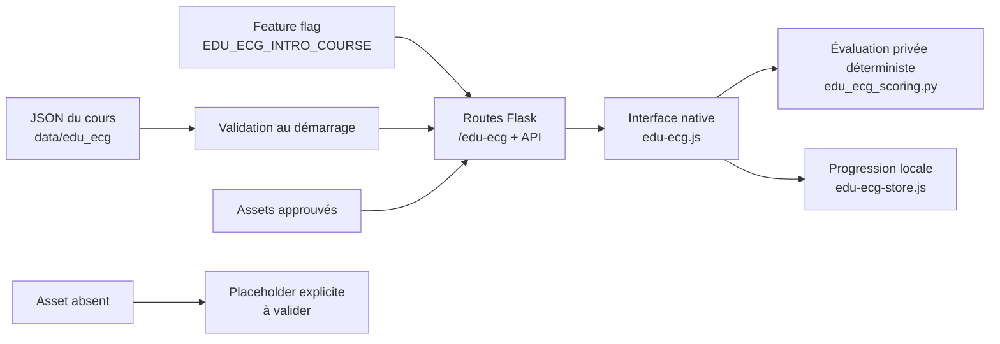

# Edu-ECG — parcours d’introduction

## Périmètre livré

Cette intégration ajoute un parcours expérimental, distinct de la banque des 75 cas :

- module 0 complet : **Avant d’interpréter : l’ECG est-il fiable ?** ;
- compétences M2.2 et M2.3 : classement des dérivations par plan et compréhension de leur axe de regard ;
- moteur générique pour les onze types d’activité déclarés dans le pack de contenu ;
- progression locale, première réponse immuable, confiance, indices gradués et bilan ;
- feature flag désactivé par défaut.

Le parcours est un prototype. Les documents source marqués `draft`, les réponses sans corrigé et les actifs manquants doivent être validés avant tout usage pédagogique de production.

## Audit du dépôt avant intégration

| Sujet | Constat | Décision |
|---|---|---|
| Stack | Flask, HTML/CSS/JavaScript natifs, sans bundler | Conserver la stack et ajouter un moteur natif testable avec Node |
| Routage | Routes Flask et fichiers statiques sous `/static` | Ajouter des routes `/edu-ecg` et `/api/edu-ecg/*` gardées par flag |
| Design | Variables partagées dans `frontend/theme.css` | Réutiliser la palette, avec une composition dédiée Edu-ECG |
| Progression | `localStorage` déjà utilisé par les parcours existants | Isoler la clé versionnée `edu-ecg:introduction:v2` et migrer la V1 |
| Pédagogie | Première réponse, confiance, indices et test autonome déjà familiers | Formaliser ces invariants dans le store et le moteur Edu-ECG |
| Assets | Flask sert les images locales | Livrer seulement les actifs approuvés ; afficher les manquants explicitement |
| Tests | Assertions Node et `unittest` Python, sans CI visible | Ajouter tests du moteur, du flux M0 et des routes |

## Architecture



Le backend valide les identifiants, les types, les phases, les statuts, les chemins d’actifs, l’unicité des activités, la politique des ressources réservées et l’absence d’indices dans un test autonome avant d’exposer le contenu.

Les clés de correction, les catégories attendues et les explications ne sont pas envoyées avec le module public. La soumission complète est évaluée par `POST /api/edu-ecg/modules/<module>/activities/<activité>/evaluate`, puis le feedback est retourné. Le navigateur ne reçoit donc aucune réponse correcte avant validation.

L’API publique ne présente que le module 0 et les activités `M2_PROBE_03` / `M2_PROBE_04`. Les autres modules du pack sont validés au démarrage, mais ne sont pas encore proposés dans l’interface.

## Règles de correction

La correction est déterministe et exécutée par Flask. Aucun LLM n’intervient.

- Une activité n’est évaluée que si le JSON fournit une clé explicite.
- Une clé absente produit le statut **non évalué — contenu à valider**.
- Une réponse libre courte est enregistrée mais n’est pas notée automatiquement dans le MVP V2.
- Une liste de noms d’erreurs critiques ne suffit pas à déduire quelle réponse les déclenche. Seul un mapping explicite `critical_error_options` peut le faire.
- Les résultats par domaine restent non évalués tant qu’une correspondance activité → domaine n’est pas fournie par le contenu.
- Les actifs ECG manquants ne sont jamais générés ou remplacés par une illustration médicale inventée.

Types pris en charge : `single_choice`, `multiple_choice`, `short_answer`, `card_sorting`, `ordering_cards`, `matching_pairs`, `image_comparison`, `image_hotspot_labeling`, `sequence_checklist`, `integrated_assessment` et `micro_lesson`.

## Session et analytics V2

Chaque session et chaque tentative possèdent un UUID. Les événements locaux suivent `event.schema.json` et contiennent la version du cours, la session, la tentative, le module, l’activité, les compétences et le temps écoulé. Les réponses elles-mêmes ne sont jamais copiées dans le journal analytics.

La confiance utilise les trois valeurs du contrat V2 : `faible`, `moyenne`, `forte`. Pour une activité avec indices, la séquence est distincte : première réponse verrouillée → indice gradué → révision → évaluation. Un test interdit l’indice, la révision et la navigation arrière.

Les huit modules JSON ont été synchronisés avec le pack V2. Seuls M0 et M2.2–M2.3 restent exposés dans ce lot ; M1 à M7 sont validés au démarrage pour préparer les lots suivants.

## Activer localement

Le flag est absent ou faux par défaut. Pour lancer le prototype :

```bash
EDU_ECG_INTRO_COURSE=1 python -m app.server
```

Puis ouvrir [http://127.0.0.1:5000/edu-ecg](http://127.0.0.1:5000/edu-ecg).

En production Scalingo, définir `EDU_ECG_INTRO_COURSE=1` seulement après validation médicale, pédagogique et visuelle.

## Vérifications

```bash
node tests/test_edu_ecg_core.js
node tests/test_edu_ecg_flow.js
node tests/test_pathway_core.js
node tests/test_pathway_dashboard.js
node tests/test_timing.js
python -m unittest tests.test_edu_ecg_scoring tests.test_edu_ecg_routes tests.test_pathway_routes tests.test_collector_metrics
```

Le dernier groupe suppose les dépendances de `requirements.txt` installées, notamment `flask-cors`.

Contrôle manuel recommandé :

1. vérifier que `/edu-ecg` retourne 404 sans flag et que la tuile n’apparaît pas sur l’accueil ;
2. activer le flag, ouvrir Edu-ECG sur un écran large puis à 390 × 844 px ;
3. terminer `M0_PRIME_01`, vérifier que la première réponse ne change plus après une révision ;
4. vérifier que les indices apparaissent seulement après verrouillage et jamais dans `M0_TEST_05` ;
5. vérifier le placeholder des actifs M0 manquants ;
6. ouvrir M2 et vérifier l’image approuvée, les douze sélecteurs de classement et la correction déterministe ;
7. agrandir l’image M2 au clavier et fermer la boîte de dialogue ;
8. recharger la page et vérifier la reprise de progression ainsi que l’immuabilité de la première réponse.

## Limites à faire valider

- Les cinq activités M0 restent au statut `draft` et leurs actifs sont réservés mais absents.
- `M0_PROBE_02`, `M0_STRENGTHEN_04` et `M0_TEST_05` ne contiennent pas de corrigé complet : elles sont enregistrées mais non notées.
- Le visuel `placeholders/m2_dii_avr_same_beat.png` de M2.3 est absent.
- Le rattachement activité → domaine de résultat n’est pas spécifié.
- L’analytics est conservée localement ; aucun envoi vers le collecteur existant n’est activé dans ce prototype.
- Les captures desktop et mobile doivent être réalisées sur l’application réellement servie avant la demande de revue.
