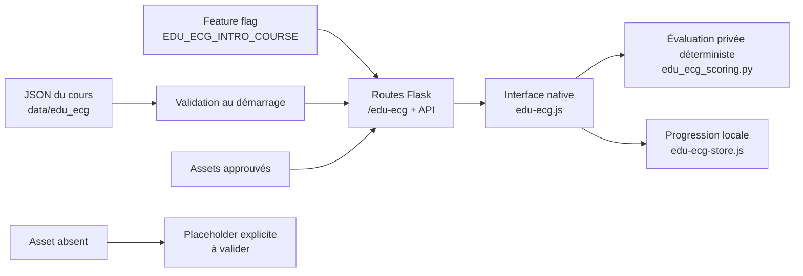

# Edu-ECG — parcours d’introduction

## Périmètre livré

Cette intégration ajoute un parcours expérimental, distinct de la banque des 75 cas :

- module 0 complet : **Avant d’interpréter : l’ECG est-il fiable ?** ;
- module 1 complet : **Du courant électrique au tracé P–QRS–T** ;
- module 2 complet : **Dix électrodes, douze dérivations** ;
- modules 3 à 6 complets : placement, procédure, réglages et laboratoire des artéfacts ;
- module 7 complet : mission finale, bilan et réactivation ;
- moteur générique pour les onze types d’activité déclarés dans le pack de contenu ;
- progression locale, première réponse immuable, confiance, indices gradués et bilan ;
- feature flag désactivé par défaut.

Le parcours est un prototype. Les documents source marqués `draft`, les réponses sans corrigé et les actifs manquants doivent être validés avant tout usage pédagogique de production.

## Audit du dépôt avant intégration

| Sujet | Constat | Décision |
|---|---|---|
| Stack | Flask, HTML/CSS/JavaScript natifs, sans bundler | Conserver la stack et ajouter un moteur natif testable avec Node |
| Routage | Routes Flask et fichiers statiques sous `/static` | Ajouter des routes `/edu-ecg` et `/api/edu-ecg/*` gardées par flag |
| Design | Variables partagées dans `frontend/theme.css` | Réutiliser la palette, avec une composition dédiée Edu-ECG |
| Progression | `localStorage` déjà utilisé par les parcours existants | Isoler la clé versionnée `edu-ecg:introduction:v2` et migrer la V1 |
| Pédagogie | Première réponse, confiance, indices et test autonome déjà familiers | Formaliser ces invariants dans le store et le moteur Edu-ECG |
| Assets | Flask sert les images locales | Livrer seulement les actifs approuvés ; afficher les manquants explicitement |
| Tests | Assertions Node et `unittest` Python, sans CI visible | Ajouter tests du moteur, du flux M0 et des routes |

## Architecture



Le backend valide les identifiants, les types, les phases, les statuts, les chemins d’actifs, l’unicité des activités, la politique des ressources réservées et l’absence d’indices dans un test autonome avant d’exposer le contenu.

Les clés de correction, les catégories attendues et les explications ne sont pas envoyées avec le module public. La soumission complète est évaluée par `POST /api/edu-ecg/modules/<module>/activities/<activité>/evaluate`, puis le feedback est retourné. Le navigateur ne reçoit donc aucune réponse correcte avant validation.

L’API publique présente les huit modules M0 à M7 dans leur ordre pédagogique. Chaque module garde son statut `draft` visible et reste protégé par le feature flag.

## Règles de correction

La correction est déterministe et exécutée par Flask. Aucun LLM n’intervient.

- Une activité n’est évaluée que si le JSON fournit une clé explicite.
- Une clé absente produit le statut **non évalué — contenu à valider**.
- Une réponse libre courte est enregistrée mais n’est pas notée automatiquement dans le MVP V2.
- Une liste de noms d’erreurs critiques ne suffit pas à déduire quelle réponse les déclenche. Seul un mapping explicite `critical_error_options` peut le faire.
- Chaque module relie ses domaines de résultat aux compétences explicites du pack. Le statut de maîtrise reste **non évalué** tant que le test autonome correspondant ne dispose pas d’un corrigé déterministe validé.
- Une sous-tâche réservée ou incomplètement spécifiée accepte une réponse qualitative afin de ne pas bloquer le parcours, mais ne produit jamais de score.
- Les actifs ECG manquants ne sont jamais générés ou remplacés par une illustration médicale inventée.

Types pris en charge : `single_choice`, `multiple_choice`, `short_answer`, `card_sorting`, `ordering_cards`, `matching_pairs`, `image_comparison`, `image_hotspot_labeling`, `sequence_checklist`, `integrated_assessment` et `micro_lesson`.

## Session et analytics V2

Chaque session et chaque tentative possèdent un UUID. Les événements locaux suivent `event.schema.json` et contiennent la version du cours, la session, la tentative, le module, l’activité, les compétences et le temps écoulé. Les réponses elles-mêmes ne sont jamais copiées dans le journal analytics.

La confiance utilise les trois valeurs du contrat V2 : `faible`, `moyenne`, `forte`. Pour une activité avec indices, la séquence est distincte : première réponse verrouillée → indice gradué → révision → évaluation. Un test interdit l’indice, la révision et la navigation arrière.

Les huit modules JSON ont été synchronisés avec le pack V2 et sont exposés. Les variantes de réponse prévues par le pack — cas répétés, choix par image, cause/action, série mélangée et checklist libre — sont conservées séparément dans la progression locale.

## Activer localement

Le flag est absent ou faux par défaut. Pour lancer le prototype :

```bash
EDU_ECG_INTRO_COURSE=1 python -m app.server
```

Puis ouvrir [http://127.0.0.1:5000/edu-ecg](http://127.0.0.1:5000/edu-ecg).

En production Scalingo, définir `EDU_ECG_INTRO_COURSE=1` seulement après validation médicale, pédagogique et visuelle.

## Vérifications

```bash
node tests/test_edu_ecg_core.js
node tests/test_edu_ecg_flow.js
node tests/test_pathway_core.js
node tests/test_pathway_dashboard.js
node tests/test_timing.js
python -m unittest tests.test_edu_ecg_scoring tests.test_edu_ecg_routes tests.test_pathway_routes tests.test_collector_metrics
```

Le dernier groupe suppose les dépendances de `requirements.txt` installées, notamment `flask-cors`.

Contrôle manuel recommandé :

1. vérifier que `/edu-ecg` retourne 404 sans flag et que la tuile n’apparaît pas sur l’accueil ;
2. activer le flag, ouvrir Edu-ECG sur un écran large puis à 375 × 812 px ;
3. terminer `M0_PRIME_01`, vérifier que la première réponse ne change plus après une révision ;
4. vérifier que les indices apparaissent seulement après verrouillage et jamais dans `M0_TEST_05` ;
5. vérifier le placeholder des actifs M0 manquants ;
6. terminer M1 et M2, notamment les cartes à ordonner et les classements au clavier ;
7. parcourir M3 à M6 et vérifier les variantes multi-cas, choix par image, cause/action et série mélangée ;
8. terminer M7, vérifier la checklist libre puis le test autonome sans indice ;
9. vérifier que les domaines restent « non évalué » lorsque leur test ne possède pas de corrigé déterministe ;
10. agrandir une image approuvée au clavier, fermer la boîte de dialogue puis recharger la page pour vérifier la reprise.

## Limites à faire valider

- Les cinq activités M0 restent au statut `draft` et leurs actifs sont réservés mais absents.
- `M0_PROBE_02`, `M0_STRENGTHEN_04` et `M0_TEST_05` ne contiennent pas de corrigé complet : elles sont enregistrées mais non notées.
- Les activités M1 et M2 restent au statut `draft`. Plusieurs visuels `source_reference` ou réservés au test ne sont pas distribuables et apparaissent comme placeholders explicites.
- Les activités M3 à M7 restent également au statut `draft`. Le seul asset approuvé de ces lots est le schéma de placement V1–V6 de M3 ; les autres ressources attendent une validation de droits ou de contenu.
- Plusieurs tests intégrés décrivent leurs domaines, mais pas encore toutes leurs sous-tâches ni leurs clés de correction : les réponses sont conservées sans notation automatique.
- Le visuel `placeholders/m2_dii_avr_same_beat.png` de M2.3 est notamment absent.
- L’analytics est conservée localement ; aucun envoi vers le collecteur existant n’est activé dans ce prototype.
- Après modification de `availability.json`, le serveur Flask doit être redémarré car le contenu validé est mis en cache au démarrage.
